# Prize Claim — Screens

Pen file: `design/playola-ios.pen` (zones "Proposal · Prize Claim" and "Proposal · Prize Claim · Claim
Sheet States")

## Navigation map
| Screen | Surface | Address | Reached from |
|---|---|---|---|
| Claim sheet | ios | n/a (native) — `PlayolaSheet` sheet | Giveaway win (up front, once) · koozie threshold crossed (up front, once) · Rewards page "Redeem" · Home prize tile |
| Home (prize tiles) | ios | n/a (native) — Home tab root | Tab bar → Home |
| Listening tile (koozie) | ios | n/a (native) — component on Home | Tab bar → Home |
| Rewards page | ios | n/a (native) — pushed onto the Profile / Home stack (unchanged) | Home → Rewards feature tile · Profile → Rewards (full-tiers users only) |
| Choice picker | ios | n/a (native) — sheet over the claim sheet | Claim sheet → a SINGLE_CHOICE field with 7+ options → disclosure row |

## Claim sheet
- **Status:** New (replaces `GiveawayWinnerSheetView`, the inline koozie address form in `KoozieTileSection`, and
  `RedeemPrizeSheetView` — see spec.md "Existing contracts")
- **Surface:** ios
- **Address:** n/a (native) — presented as a `PlayolaSheet` sheet over the current tab
- **Access:** signed-in listener who owns the fulfillment request (or has earned the unclaimed koozie)
- **Navigated to from:**
  - Giveaway win → presented automatically, once per prize, when the user's win is discovered
  - Koozie listening threshold crossed → presented automatically, once (Reward · Not Yet Claimed state)
  - Rewards page → "Redeem" on a tier → opens in Reward · Not Yet Claimed; "Claim it" calls
    `POST /v1/users/me/reward-redemptions`, then the form
  - Home → prize tile (one per `awaiting_info` request or unclaimed koozie)
- **Navigates to:**
  - SINGLE_CHOICE field with 7+ options → Choice picker
  - "Send it to me" → Sending → Sent (or Send failed)
  - "I'll finish this later" or swipe down → dismiss (counts as Later; the Home prize tile is the
    re-entry). Swipe-dismiss is disabled while Loading or Sending.
  - "Done" (Sent / Nothing to fill in / No longer open) → dismiss

The form is generated from the request's `infoFields`: SHORT_TEXT → text field, MULTI_LINE_TEXT →
text area, ADDRESS → US address block (State picker, ZIP number pad, autofill content types),
SINGLE_CHOICE → rendered by option count:
- 2–5 options and every label ≤ 4 characters → segmented chips (one row, full form width, equal
  widths, fixed 8pt gap, 44pt tall)
- otherwise ≤ 6 options → inline single-selection list
- 7+ options → disclosure row opening the Choice picker

For optional fields, tapping the selected chip or row deselects it. An optional ADDRESS is all-or-nothing:
left wholly blank it is skipped; partly filled, Send stays disabled until it is complete. When `imageUrl` is null the header
collapses (no image; "YOU WON" pill + title).

| State | When it shows | Node | Mockup |
|---|---|---|---|
| Form · with image | Request has required fields; prize has `imageUrl` | `eiTMx` | 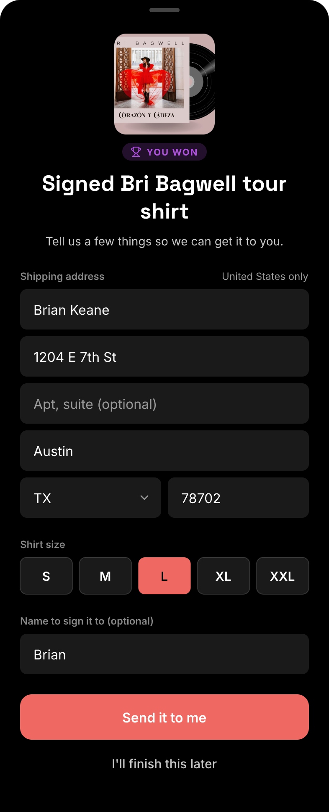 |
| Form · no image | Same, `imageUrl` is null | `kiqOK` | 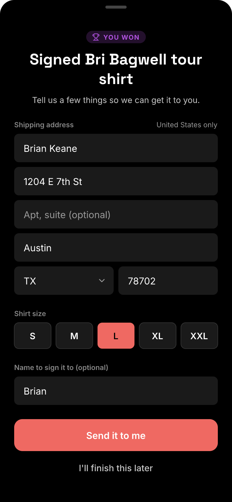 |
| Form · inline choice list | A SINGLE_CHOICE field that isn't chip-eligible and has ≤ 6 options | `wGxLF` | 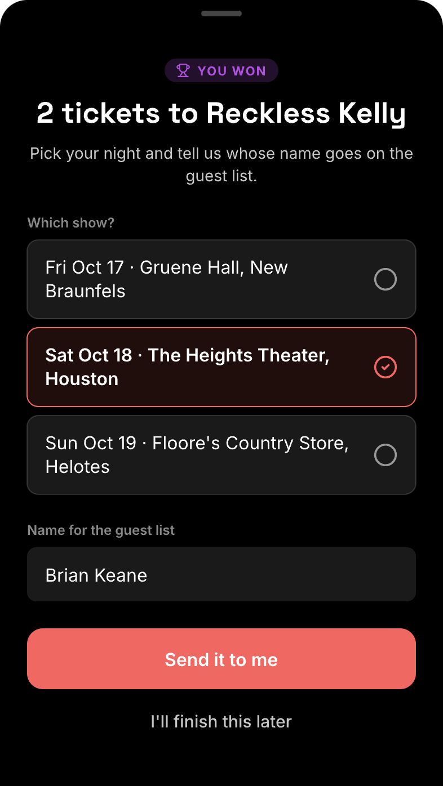 |
| Choice · chips | SINGLE_CHOICE, 2–5 options, all labels ≤ 4 chars | `K4D70` | 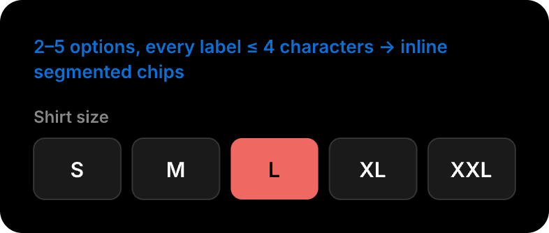 |
| Choice · inline list | SINGLE_CHOICE, not chip-eligible, ≤ 6 options | `tp5TU` | 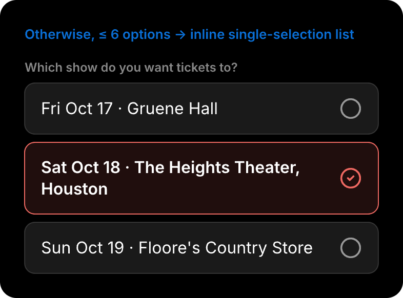 |
| Choice · picker row | SINGLE_CHOICE, 7+ options | `S28a1a` | 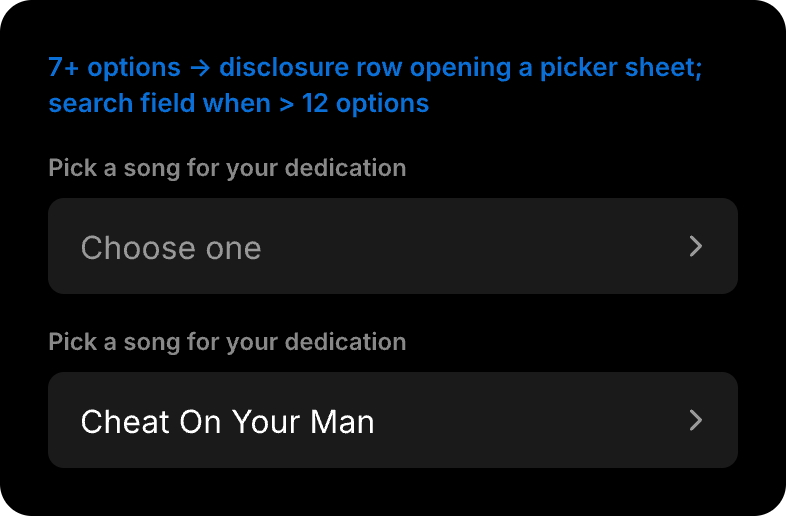 |
| Reward · not yet claimed | Koozie earned, not yet redeemed (no request exists yet) | `Upib6` | 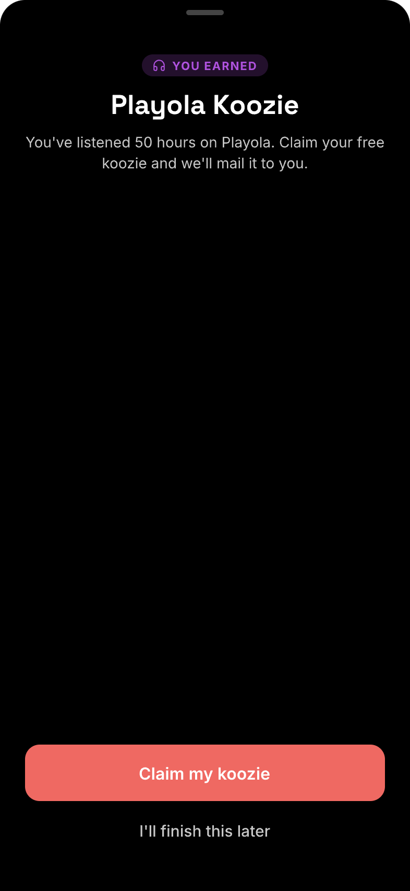 |
| Loading | Reward redemption in flight after "Claim it" (`POST …/reward-redemptions`) | `vNp75` | 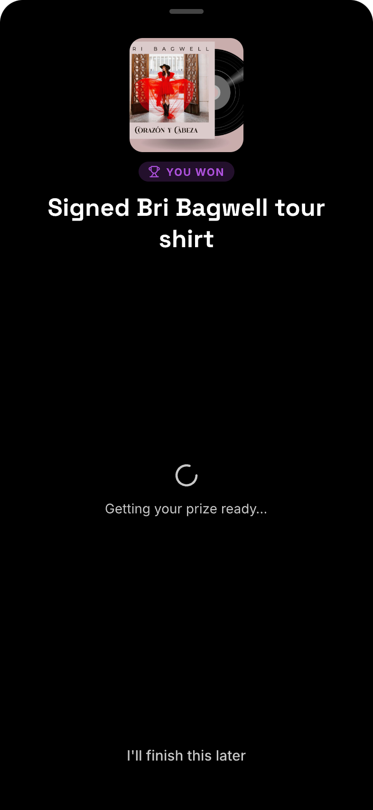 |
| Incomplete | A required field is empty (after trimming) or the ZIP isn't 5 digits — Send disabled with a hint naming what's missing ("Enter a 5-digit ZIP code" for a bad ZIP) | `Py5xL` | 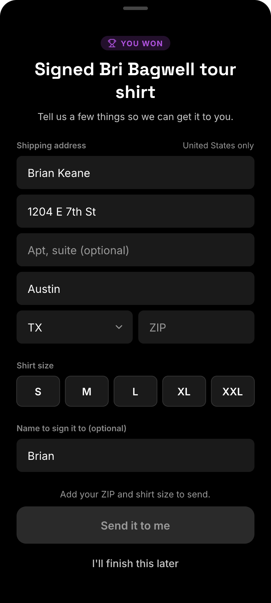 |
| Sending | `PUT …/answers` in flight — fields and Later dimmed | `P0ErfC` | 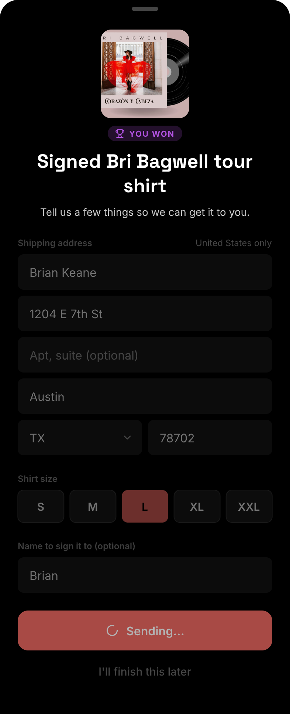 |
| Send failed | `PUT …/answers` failed — answers kept, "Try again". Network / 5xx uses the connection copy shown; a 400 uses "Some of your answers didn't go through. Check them and try again." | `u7f7m` | 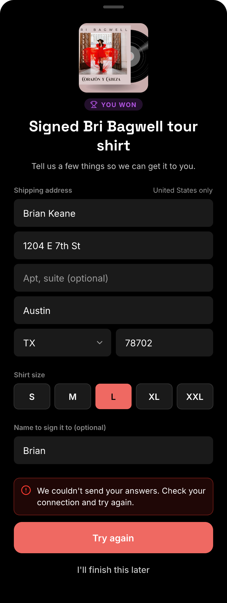 |
| No longer open | `PUT …/answers` returned 403 / 404 / 409 (winner reassigned, request gone, fulfilled or canceled), or the reward POST returned 403 / 404 — Home's tile list is refetched | `Kv6L0` | 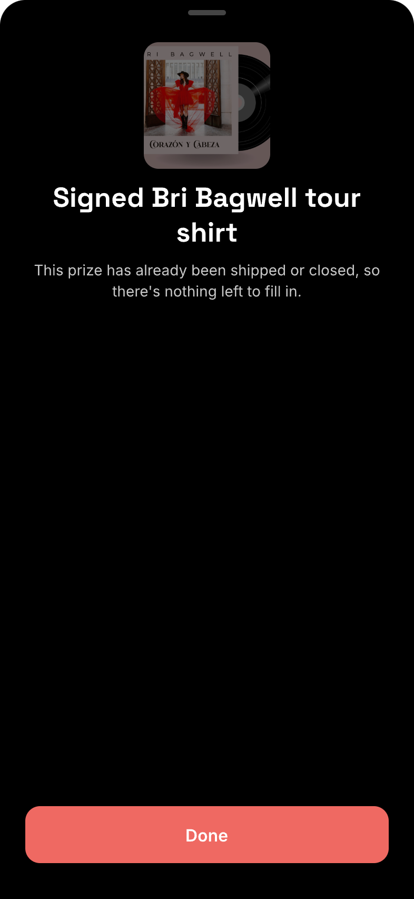 |
| Nothing to fill in | Request has no required `infoFields` | `n2xDx4` | 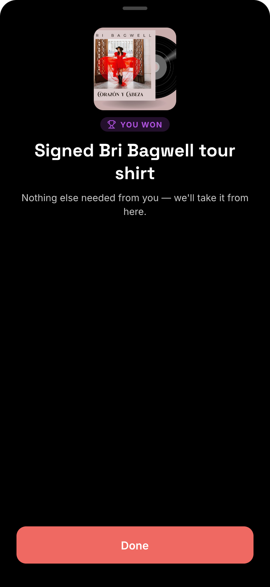 |
| Sent | `PUT …/answers` succeeded | `yS1Dw` | 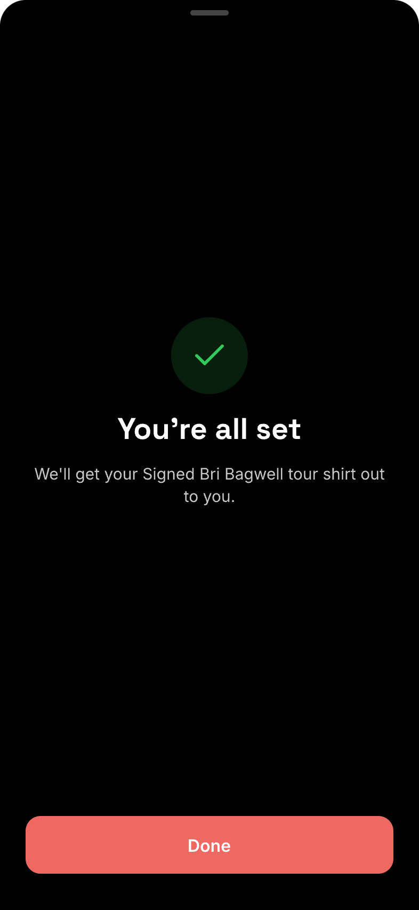 |

## Choice picker
- **Status:** New
- **Surface:** ios
- **Address:** n/a (native) — sheet presented over the Claim sheet
- **Access:** same as Claim sheet
- **Navigated to from:**
  - Claim sheet → SINGLE_CHOICE disclosure row (fields with 7+ options)
- **Navigates to:**
  - Tap an option → selects it, dismisses back to the Claim sheet
  - Close (✕) or swipe down → dismiss without changing the selection

A search field appears only when the field has more than 12 options. A "None" row appears only when
the field is optional.

| State | When it shows | Node | Mockup |
|---|---|---|---|
| Default | Disclosure row tapped | `r3ZvbY` | 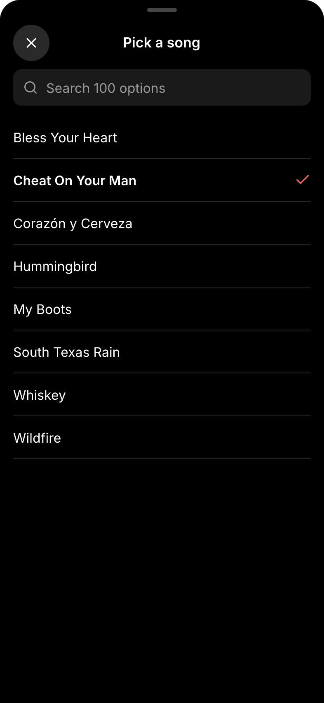 |

## Home (prize tiles)
- **Status:** Changed
- **Surface:** ios
- **Address:** n/a (native) — root of the Home tab
- **Access:** signed-in listener
- **Navigated to from:**
  - Tab bar → Home (unchanged)
- **Navigates to:**
  - Prize tile → "Claim your prize" / "Claim my koozie" → Claim sheet for that prize
- **Changed from today:** one `NewFeatureTile` per prize the user still needs to act on is added
  above the existing feature tiles — one per `awaiting_info` fulfillment request in the server's order
  ("You won" for giveaways, "You earned" for rewards), then one for an earned-but-unclaimed koozie last. A
  tile disappears once its request leaves `awaiting_info`. With no such prize, Home is unchanged. If the
  list fails to load, Home keeps the tiles it last showed and retries on the next appear / foreground.
  Current Home: 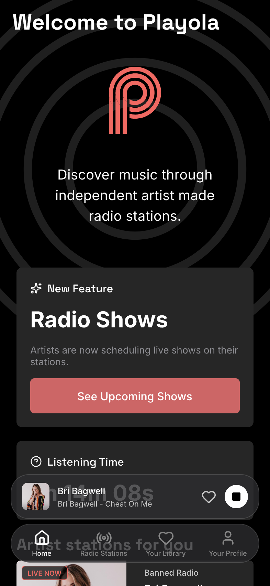

| State | When it shows | Node | Mockup |
|---|---|---|---|
| One prize | One giveaway request is `awaiting_info` | `Xr7bh` | 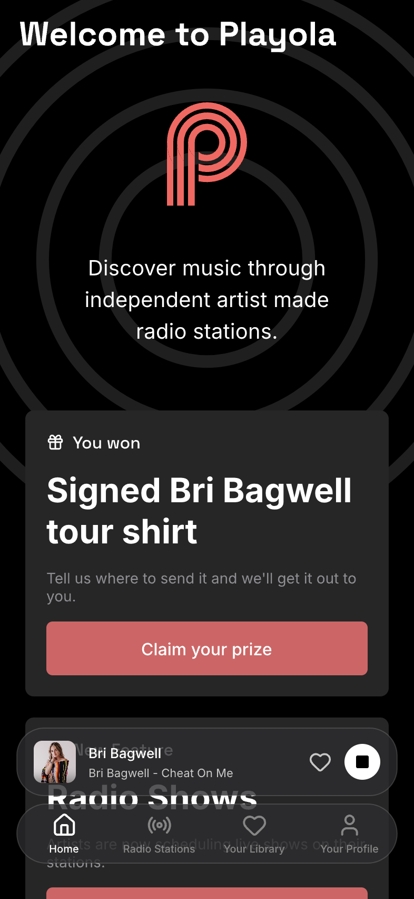 |
| Several prizes | A giveaway request plus an unclaimed koozie (requests first, koozie last) | `UdaDn` | 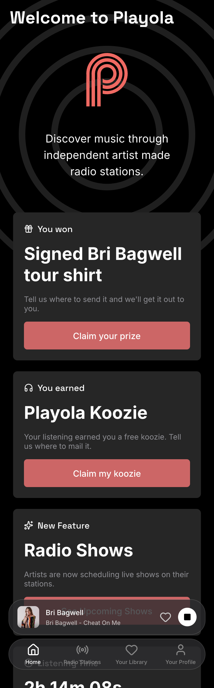 |

## Listening tile (koozie section)
- **Status:** Changed
- **Surface:** ios
- **Address:** n/a (native) — `ListeningTimeTile` component on Home (koozie-only cohort)
- **Access:** signed-in listener in the koozie-only rewards cohort
- **Navigated to from:**
  - Tab bar → Home (unchanged)
- **Navigates to:** nothing — the tile no longer has a claim button; the Home prize tile is the only
  claim entry point
- **Changed from today:** the "Redeem your koozie" button, the inline "Where should we send it?"
  address form, and the post-claim congrats card (with its ✕ dismiss) are removed. Earned-but-unclaimed
  now points at the Home prize tile; claimed reads "Koozie claimed — thanks for listening!" (was
  "Koozie redeemed — check your email"; the new redemption sends no email). The in-progress bar is
  unchanged. Today's koozie section is code-only (`KoozieTileSection.swift`), so there is no canvas
  "before" image.

| State | When it shows | Node | Mockup |
|---|---|---|---|
| Earned, not claimed | Listening hours ≥ koozie threshold, koozie not yet redeemed | `GWKZh` | 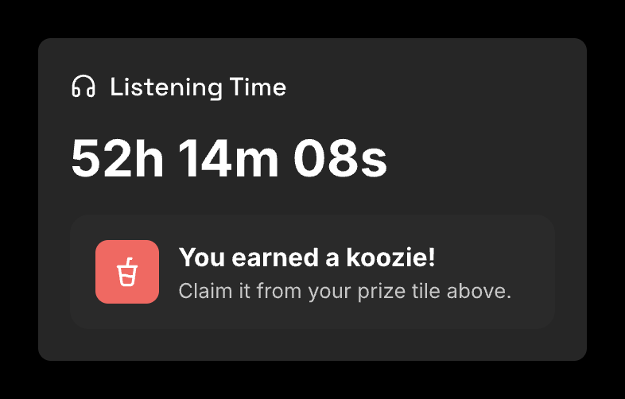 |
| Claimed | Koozie redeemed (whether or not the claim form is finished) | `wtGs8` | 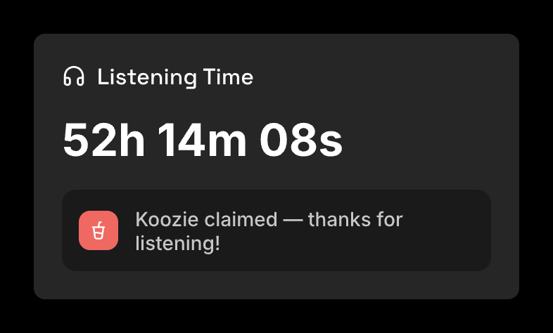 |

## Rewards page
- **Status:** Changed (behavior only — no visual change)
- **Surface:** ios
- **Address:** n/a (native) — `RewardsPageView`, pushed via `pushRewards` (unchanged; koozie-only users
  never reach it)
- **Access:** signed-in full-tiers listener
- **Navigated to from:** unchanged (Home → Rewards feature tile; Profile → Rewards)
- **Navigates to:**
  - "Redeem" on an earned tier → Claim sheet in Reward · Not Yet Claimed (`Upib6`, with that tier's prize
    title), then the Claim sheet flow. "Claim it" redeems the tier's single prize; a tier with no prize
    hides Redeem. A successful claim (or an "already redeemed" 409) marks the tier redeemed on return.
- **Changed from today:** "Redeem" no longer opens `RedeemPrizeSheetView` ("Redeem Reward" sheet with a
  per-station picker and an "Email for follow-up" field) and no longer ends in the "Prize redeemed"
  alert; both are deleted. The Claim sheet's Sent / Nothing to fill in states replace the alert. No
  `stationId` is sent — no production tier is per-station (2026-10-05: Koozie 50h, Show Tix 500h,
  Meet & Greet 1000h, all `perStation = false`). Today's Rewards page is code-only, so there is no
  canvas "before" image.

No new state frames: the page renders exactly as today, and every state after "Redeem" is a Claim sheet
state above.
